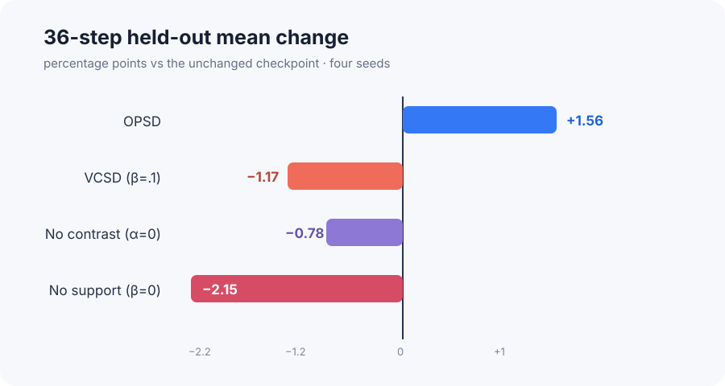
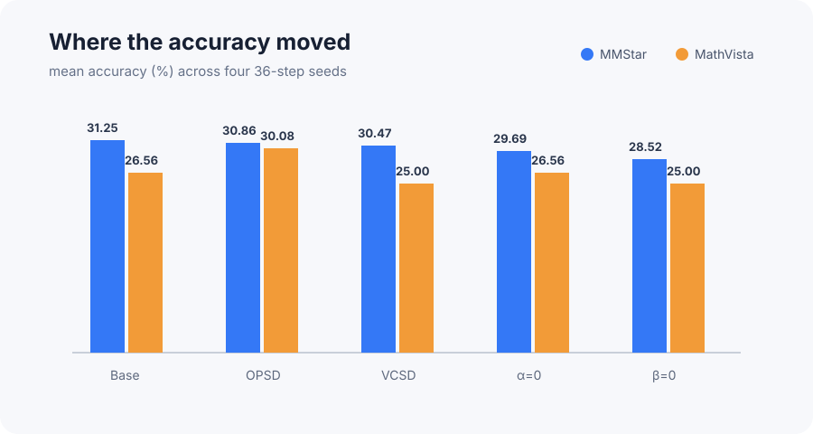
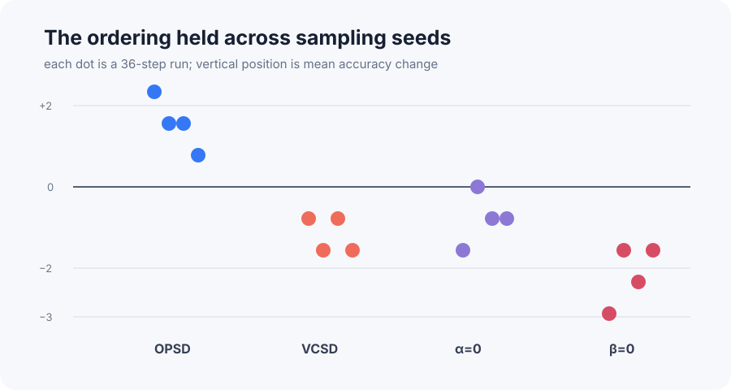
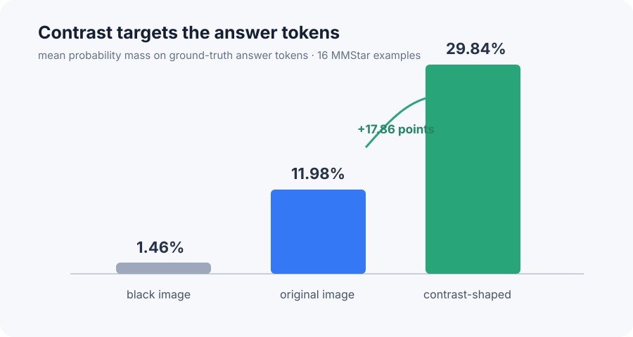
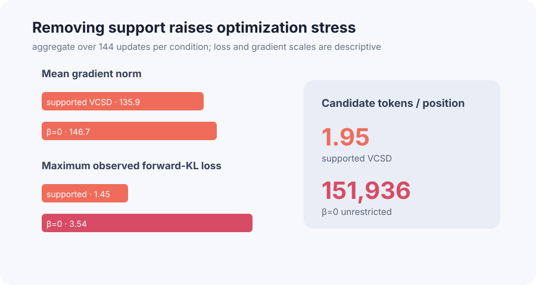

# Visual Contrastive Self-Distillation: a bounded reproduction

Vision-language models can learn from their own predictions, but those predictions may reflect language habits more than the image. The paper proposes comparing a slowly updated teacher’s predictions on the real image and a blacked-out copy, then emphasizing answer choices that depend on visual content. This reproduction tests whether that idea improves a public 2B model and whether the proposed token-level mechanism is visible.

## Verdict

**Not reproduced.** On fixed public subsets, the headline accuracy gain was not observed: across four 36-update seeds, matched OPSD changed the two-benchmark mean by **+1.56 points**, while supported VCSD changed it by **−1.17 points**. The mechanistic diagnostic did align—contrast shaping increased mean probability on ground-truth answer-token variants from **11.98% to 29.84%**—and removing the support restriction caused a larger **−2.15-point** degradation.

This is a short-horizon test: 48 ViRL39K training items, 64 MMStar and 64 MathVista evaluation items, batch one, one rollout, and 12 or 36 updates. It is evidence about this bounded setup, not the paper’s full 38,870-item, seven-benchmark campaign.

How to read this figure: bars to the right improve over the unchanged checkpoint; bars to the left degrade. Every 36-step bar averages four sampling seeds over exactly the same public training and evaluation rows.

## What was implemented

The public `Qwen/Qwen3-VL-2B-Instruct` checkpoint served as both student and initial teacher. After every student update, the teacher moved 5% toward the student. For each generated token, VCSD computed teacher log probabilities on the original image and a same-sized black image. Their difference was added to the original-image score with contrast strength 1.

Only tokens whose original probability was at least 10% of the most likely token remained eligible. A softmax over these shaped scores formed the target, and the student minimized forward KL. The OPSD control used the same sampling, optimizer, token budget, update count, and moving teacher, but supplied the teacher with the reference answer and omitted visual contrast. The unrestricted ablation set the support threshold to zero; the no-contrast ablation set contrast strength to zero. The final implementation uses a zero-safe KL for masked tokens and extends Qwen3-VL’s multimodal token-type mask through generated suffixes.

## Accuracy evidence

The paper’s full evaluations and this subset are not numerically interchangeable: our unchanged model scored only 31.25% on MMStar and 26.56% on MathVista, partly because generation was capped at 32 tokens and scored with a strict local extractor.

| Evidence | Base | OPSD | VCSD |
|---|---:|---:|---:|
| Paper MMStar | 57.47 | 60.73 | 63.73 |
| Observed MMStar, 36 steps | 31.25 | 30.86 | 30.47 |
| Paper MathVista | 62.50 | 64.70 | 66.10 |
| Observed MathVista, 36 steps | 26.56 | 30.08 | 25.00 |
| Observed two-task mean | 28.91 | 30.47 | 27.73 |

The same ordering appeared earlier: across five 12-update seeds, OPSD averaged **+0.47 points**, supported VCSD **−0.47**, and unrestricted VCSD **−1.09**. At 36 updates, every OPSD seed was positive and every supported VCSD seed was negative.

**Claim assessment:** the reported VCSD advantage over the unchanged checkpoint and matched OPSD is **not aligned in this tested setup**. The divergence is 2.73 points between VCSD and OPSD at 36 updates.

## Mechanism evidence

On 16 MMStar prompts, ground-truth answer-token variants received 1.46% mean mass with a black image and 11.98% with the original image. Applying the paper’s contrast and support rule raised the hypothetical target mass to 29.84%, a **+17.86-point** shift. Answer variants entered the plausible support on 43.75% of examples, so the effect was strong but selective.

Support also mattered behaviorally. Across four 36-update seeds, unrestricted VCSD degraded by 2.15 points versus 1.17 for supported VCSD. All runs remained finite, so this was not catastrophic numerical divergence; it was a larger accuracy loss with a 151,936-token target support instead of roughly two candidates per position.

**Claim assessment:** increased answer-token mass is **aligned**; the stability claim is **partially aligned** because removing support worsened accuracy and peak KL, but did not produce non-finite training.

## Compute, limitations, and conclusion

All evidence ran on the configured **Kubernetes** backend using **NVIDIA RTX PRO 6000 Blackwell Server Edition** GPUs. Peak concurrency was **16 GPUs**. From the first fresh job at 02:56:46Z to the final diagnostic at 03:46:56Z, actual compute wall time was **50m10s (0.84 hours)**. Successful 12-step jobs took about 2m43s wall time each; 36-step jobs about 2m54s; the answer-token diagnostic took 2m38s.

The paper did not provide its VCSD code, so prompt format, rollout length, optimizer details, scoring, and exact subset selection are explicit substitutions. The tiny training set, batch-one updates, strict truncated evaluation, and much lower starting scores can easily dominate sub-point effects. A decisive full reproduction still needs the full ViRL39K schedule, official prompts and scorers, eight-rollout batches, saved checkpoints, and all seven benchmarks.

Overall, this study verifies that visual contrast can strongly reshape the intended answer tokens and that unrestricted support is more damaging. It does **not** show the paper’s claimed accuracy advantage for supported VCSD over matched OPSD on the tested public subsets.

Key branches: [base evaluation](https://github.com/alphaXiv/macil-sd-75f90e4d/tree/orx/base-final-call-repair), [12-step OPSD](https://github.com/alphaXiv/macil-sd-75f90e4d/tree/orx/opsd-token-type-repair-seed0), [12-step VCSD](https://github.com/alphaXiv/macil-sd-75f90e4d/tree/orx/vcsd-token-type-repair-seed0), [36-step VCSD](https://github.com/alphaXiv/macil-sd-75f90e4d/tree/orx/vcsd-supported-36-step-horizon-seed0), and [answer-token diagnostic](https://github.com/alphaXiv/macil-sd-75f90e4d/tree/orx/vcsd-ground-truth-answer-token-diagnostic).
